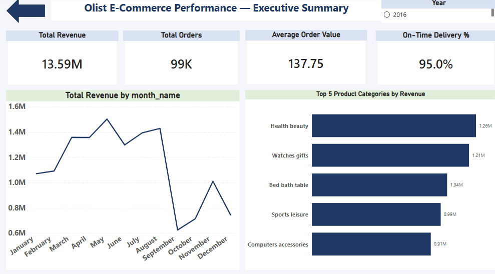
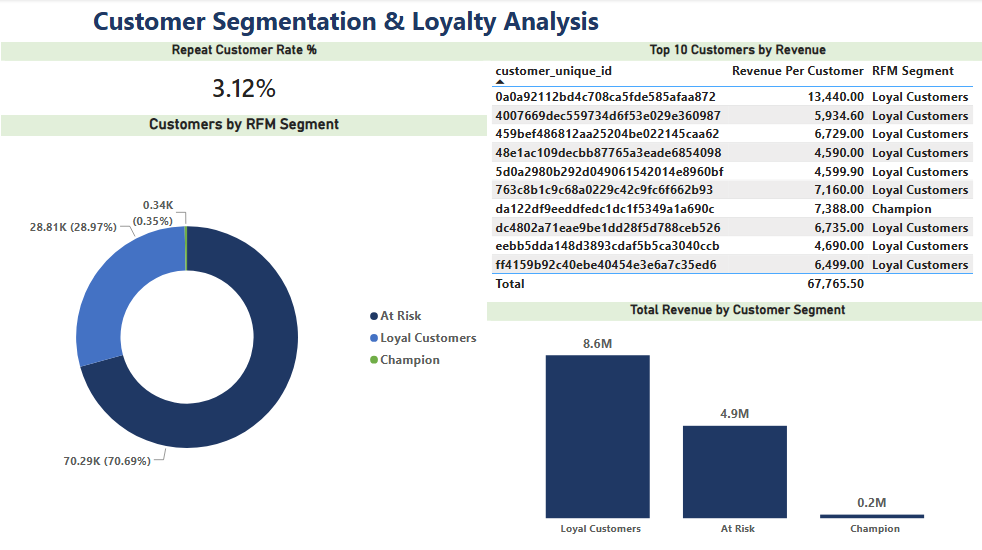
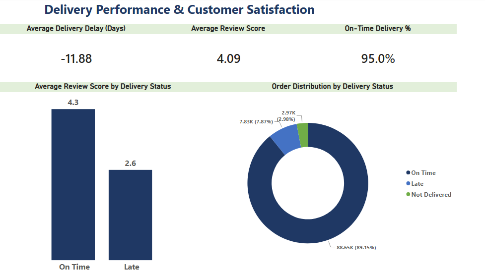
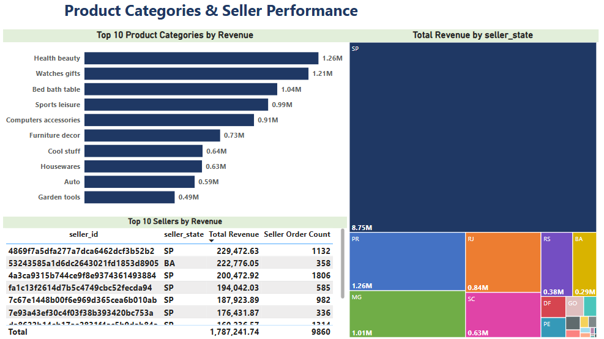

# Olist E-Commerce Data Warehouse & Power BI Analytics

End-to-end business intelligence project: built a star-schema data warehouse in SQL Server and an interactive Power BI dashboard to analyze ~99,000 orders from the Olist Brazilian e-commerce dataset.

## Business Questions

1. Who are the top customers by revenue?
2. How does late delivery affect customer review scores?
3. Which product categories generate the highest revenue?
4. Who are the top-performing sellers?
5. What percentage of customers make repeat purchases (retention)?
6. What is the average actual delivery time vs. the estimated delivery time?

## Data Source

[Brazilian E-Commerce Public Dataset by Olist](https://www.kaggle.com/datasets/olistbr/brazilian-ecommerce) — Kaggle. 9 relational CSV files covering orders, customers, products, sellers, payments, and reviews (2016–2018).

## Tools Used

SQL Server · Power BI · DAX · Power Query

## Project Workflow

1. **Data Import & Verification** — Loaded 9 raw CSV files into SQL Server staging tables, verified row counts against the source.
2. **Data Quality & Cleaning** — Checked every table for nulls, duplicates, and inconsistencies; fixed a mis-imported header row and corrected floating-point price precision.
3. **Star Schema Design** — Modeled a warehouse (`dwh` schema) with 5 dimension tables and 3 fact tables.
4. **Power BI Modeling** — Connected to the warehouse, built relationships, and wrote 15+ DAX measures including RFM customer segmentation.
5. **Dashboard Build** — 4-page interactive report answering all 6 business questions.

## Star Schema

- **Dimensions:** Dim_Customer, Dim_Product, Dim_Seller, Dim_Order, Dim_Date
- **Facts:** Fact_OrderItems, Fact_Payments, Fact_Reviews

## Dashboard

### Executive Summary

### Customer Segmentation (RFM)

### Delivery Performance & Satisfaction

### Products & Sellers

## Key Insights

- **Late deliveries drop average customer rating by 1.7 points** (4.3 → 2.6), despite only 7.9% of orders arriving late — delivery reliability is the strongest driver of satisfaction.
- **Only 3.12% of customers make a repeat purchase** — the business relies almost entirely on new customer acquisition rather than retention.
- **70.7% of customers fall into the "At Risk" RFM segment**, while "Loyal Customers" (29%) generate 8.6M of the 13.59M total revenue — a small customer base drives most of the business.
- Orders are delivered **11.88 days earlier than estimated on average**, suggesting Olist's delivery estimates are overly conservative.
- **São Paulo (SP)** dominates seller revenue, far ahead of all other states.

## Data Quality Notes

- `product_category_name_translation`: first row was mis-imported as data (fixed).
- 8 orders marked "delivered" have a missing delivery date (documented, not fixed — source data inconsistency).
- `customer_id` is generated per order in the raw dataset; `customer_unique_id` was used for all customer-level analysis (RFM, repeat rate).
- Two product categories had no official English translation; manually translated (`pc_gamer`, `portateis_cozinha_e_preparadores_de_alimentos`).

## Repository Structure

## Author

**Farouk Abdelrahman**
[LinkedIn](https://www.linkedin.com/in/farouk-apd-elrahman-260448327)